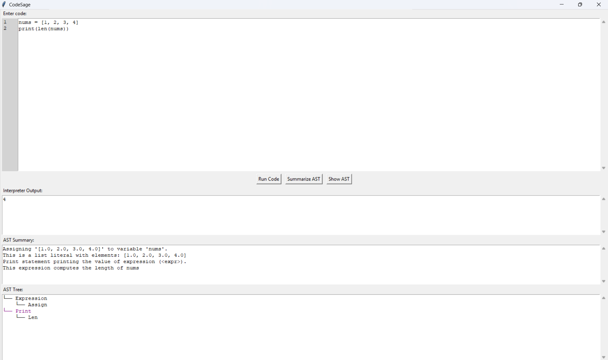

#  CodeSage GUI

##  Overview
The **CodeSage GUI** is a **Tkinter-based Integrated Development Environment (IDE)** that allows users to:

- Write and edit source code with **line numbers**.  
- Execute code using the **CodeSage interpreter**.  
- View **runtime output**, **AST structure**, and **code summaries**.  
- Interactively explore how interpreters and NLP engines work under the hood.

The GUI serves as the **central hub** for the entire CodeSage system.

---

## Responsibilities

- Provide a **code editor** with syntax support and line numbers.  
- Display **output console** for interpreter results.  
- Show **AST visualizations**.  
- Present **structured and NLP-generated code summaries**.  
- Enable **real-time interaction** (run, clear, stop execution).  

---

##  Major Components

### 1️.Code Editor
- A `ScrolledText` widget with line numbers.  
- Supports **multi-line editing** and basic **text selection**.  
- Optional: syntax highlighting for better readability.

### 2️.Output Console
- Displays **interpreter output** and **runtime errors**.  
- Uses `ScrolledText` for scrollable output.  
- Colored or formatted output can differentiate **errors** from **normal prints**.

### 3️.AST Viewer
- Shows the **Abstract Syntax Tree** of the entered code.  
- Can be implemented using **nested tree view** or textual tree representation.  
- Helps users **understand code structure** without execution.

### 4️.Summary / Explanation Panel
- Displays **structured AST summaries**.  
- Updates **in real-time** as the user edits or runs code.

### 5️.Control Buttons
- **Run**: executes the current code.  

---

---

These examples demonstrate that CodeSage’s Interpreter can correctly parse, execute, and evaluate a wide range of Python-like constructs including arithmetic, conditionals, loops, functions, and error handling — providing a near-complete execution environment for educational and analysis purposes.