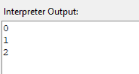
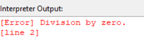
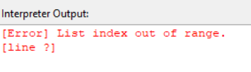

#  Interpreter

##  Overview
The **Interpreter** in CodeSage is a **Tree-Walk Interpreter** that executes programs **directly from the Abstract Syntax Tree (AST)**.  
It recursively visits each AST node to **evaluate expressions**, **execute statements**, and manage **variable scopes and environments**.

It supports:
- Control flow: `if`, `elif`, `else`, `while`, `for`, `break`, `continue`  
- Functions: user-defined 
- Lists, indexing, and built-in operations (`len`, `range`)  
- Runtime error handling  

---

##  Responsibilities

- Evaluate **expressions** (arithmetic, logical, comparison, unary, binary).  
- Execute **statements** (variable declarations, print, blocks, conditionals, loops, function definitions).  
- Manage **environments and variable scopes**.  
- Handle **runtime errors** (undefined variables, division by zero, invalid operations).  
- Provide **runtime output** for the IDE console.


---

## Key Components

### 1.Environment
- Stores variables and their values.
- Supports nested scopes via enclosing environments.
- Provides:
    - define(name, value) → creates a new variable
    - get(name_token) → retrieves a variable
    - assign(name_token, value) → updates a variable
    - get_at / assign_at → for resolved variable depths
---

### 2.Control Flow
Supports:
- If / Elif / Else Statements
- While Loops (with safety check for infinite loops)
- For Loops (iterables and numeric ranges)
- Break / Continue statements using exceptions
---

### 3.Functions
- User-defined functions (PyFunction) support parameters, closures, and return values.
- Native functions (e.g., clock) provide built-in utilities.
- Function calls:
    - Verify the number of arguments matches the function’s arity.
    - Create a new environment for local variables.
    - Execute the function body.
    - Handle return values using ReturnException.
---

### 4.Expression Evaluation
- Supports:

    - Literal, Unary, Binary, Grouping expressions
    - Variable lookup and assignment
    - Logical operators (and, or)
    - Function calls (call_expr)
    - Lists, indexing, and range expressions
    - Built-in operations: len(), range()


### Example
```
x = 0
while (x < 3):
    print(x)
    x = x + 1
```


### 5.Runtime Error Handling
- Error Type	
- Undefined Variable	
- Division by Zero	
- Invalid Operation	
- Index Out of Range	
- Non-iterable in For Loop	

Errors are reported via CODESAGE.runtime_error with line number if available.

### Example
```
x=5
print(x/0)
```


```
list=[1,2,3,4]
list[5]=6
```


