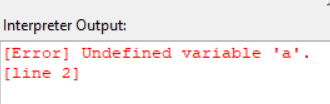
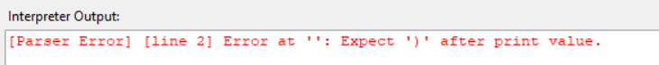

#  Parser

##  Overview
The **Parser** is the second stage of the CodeSage pipeline.  
It takes the list of **tokens** produced by the Scanner and organizes them into a structured representation known as the **Abstract Syntax Tree (AST)**.

The Parser in CodeSage uses a **Recursive Descent Parsing** approach — a top-down method where each grammar rule corresponds to a Python method.  
This makes it **intuitive, modular, and easy to debug**.

---

##  Responsibilities

- Convert the flat list of tokens into a **hierarchical tree structure (AST)**.  
- Detect and report **syntax errors**.  
- Implement **error recovery** using *panic mode* to continue parsing after an error.  
- Pass the generated AST to other components (Resolver, Interpreter, and Summarizer).


---

##  Example

### Input Code:
```
a=25
if a >=18:
    print("Adult")
else:
    print("Child")

```

### Parser Output
```
[Parser Output]:
ExpressionStmt(
  Assign(a)
    Literal(25.0)
)

IfStmt(
  Condition:
    Binary(>=)
      Variable(a)
      Literal(18.0)
  Then:
    BlockStmt(
      PrintStmt(
        Literal(Adult)
      )
    )
  Else:
    BlockStmt(
      PrintStmt(
        Literal(Child)
      )
    )
)
```
---

## Error Handling in Parser
The Parser detects syntax errors, i.e., problems with the order or structure of tokens.

Common Parser Errors

Unexpected Token
Unmatched Parentheses
Invalid Expression	
Invalid Statement

## How Parser handles them

- **Raise Exception**: When a rule fails, the parser raises a syntax exception.
- **Panic Mode**: The synchronize() method skips tokens until a safe point (e.g., semicolon or start of a new statement) to continue parsing.
- **Multiple Error Reporting**: This ensures the parser reports all errors in a single run rather than stopping at the first one.

---

## Example
### Input code
```
d=5
print(a)
```

```
x=105
print(x
```


---
The parser continues parsing after errors, allowing multiple mistakes to be detected.