# Results and Demonstrations

This document presents sample **code snippets** and their corresponding **outputs** produced by the CodeSage interpreter.  
Each snippet demonstrates how different language constructs — variables, expressions, conditionals, loops, and functions — are executed in the tree-walk interpreter.

---
## 1️.Variable Declaration & Assignment

```
x = 10
y = 5
print(x + y)

```
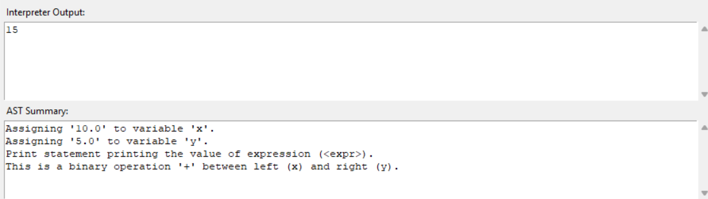

---


## 2.Variable Declaration & Assignment
```
print (3 + 5 * 2 - 4 / 2)

```
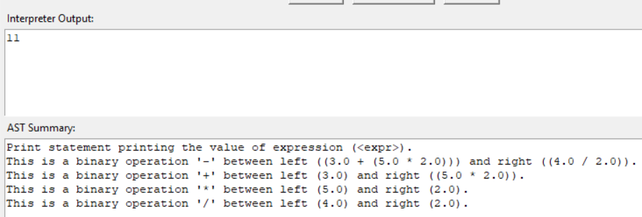

---

## 3️.Comparison & Logical Operators
```
a = 10
b = 20
print(a < b)
print(a > b)
print(a == b)
print(a != b)
print(a < b and b > 15)
print(a > b or a == 10)
```
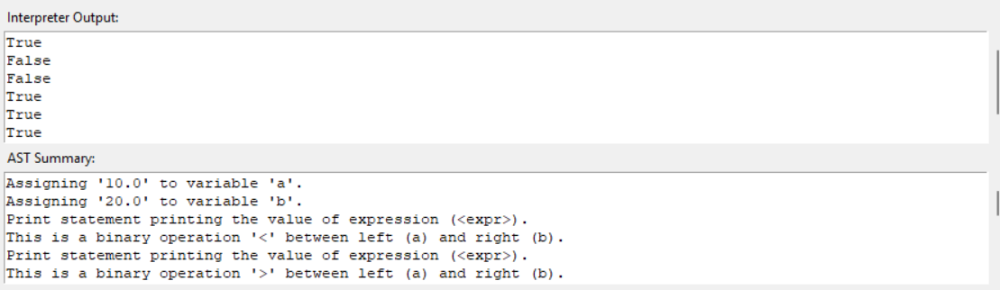

---

## 4.If–Else Statements
```
score = 72
if score >= 50:
    print("Pass")
else:
    print("Fail")
```
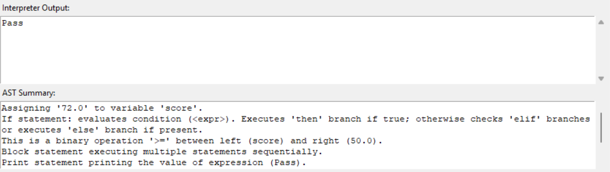

---

## 5.If–Elif–Else Chain
```
marks = 85
if marks >= 90:
    print("Excellent")
elif marks >= 75:
    print("Good")
else:
    print("Needs Improvement")

```
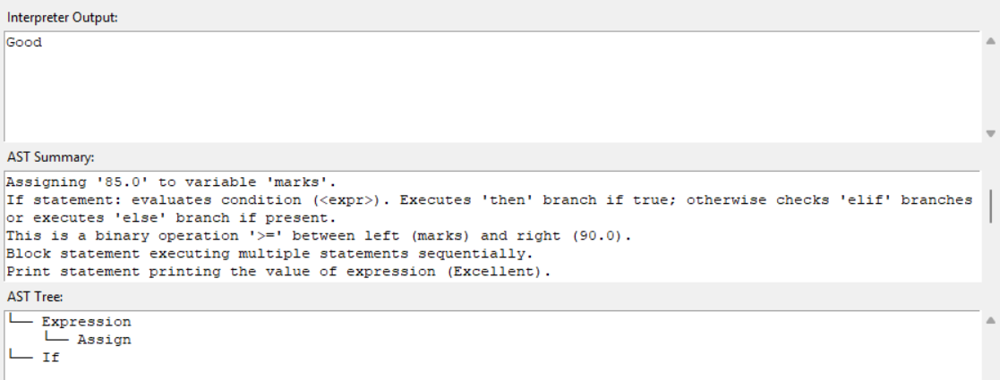

---
## 6.While Loop
```
i = 0
while i < 5:
    print(i)
    i = i + 1
```

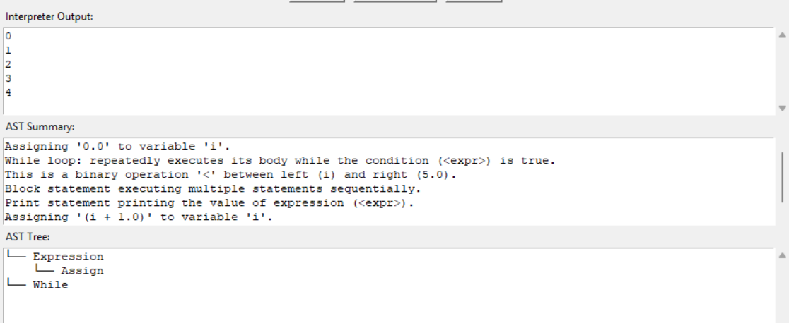

---

## 7️.For Loop (with range)
```
for i in range(3):
    print(i)
```
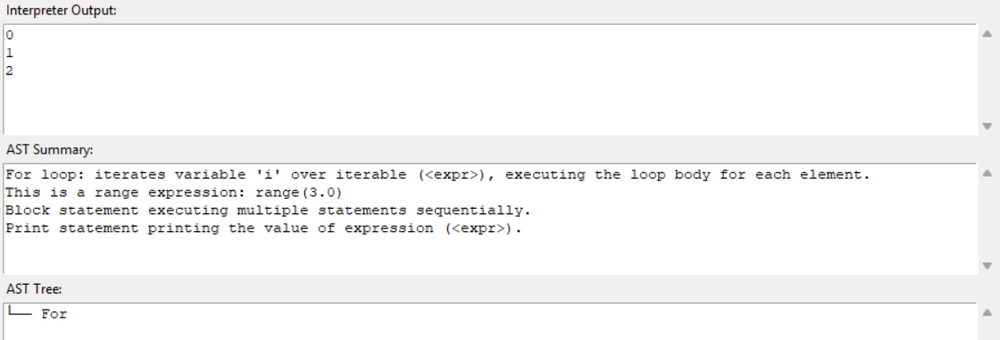

---

## 8.Break and Continue
```
for i in range(5):
    if i == 2:
        continue
    if i == 4:
        break
    print(i)
```
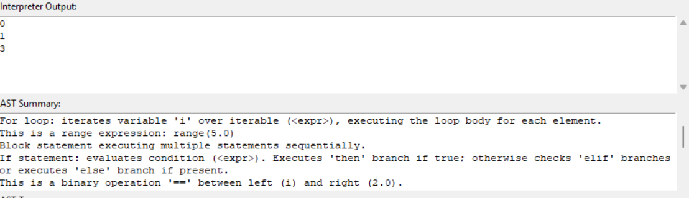

---

## 9.Function Definition and Return
```
def add(a, b):
    return a + b

result = add(4, 6)
print(result)
```
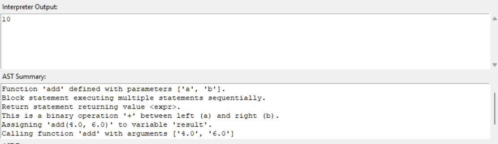

---

## 10.Nested Function Calls
```
def square(x):
    return x * x

def double(y):
    return y + y

print(double(square(3)))
```
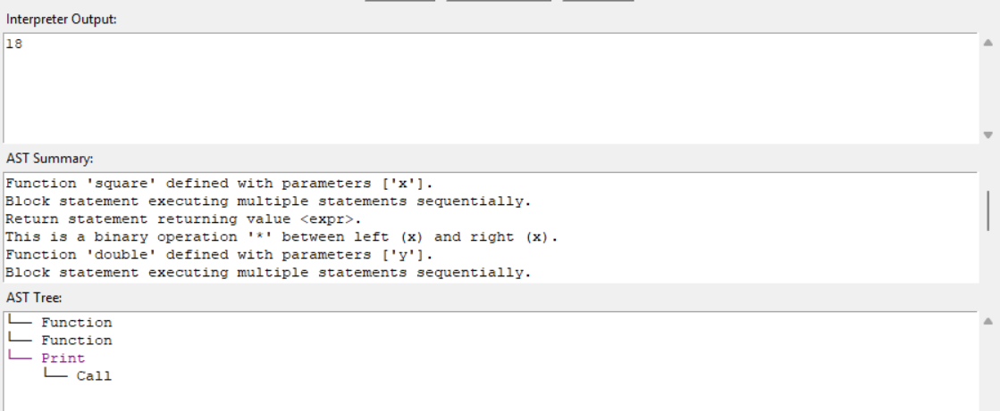

---

## 11.Lists and Indexing
```
items = [10, 20, 30]
print(items[0])
items[1] = 100
print(items)
```

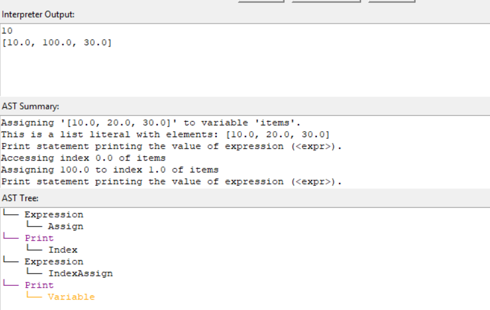

---

## 12.Range Expression
```
for i in range(2, 8, 2):
    print(i)
```

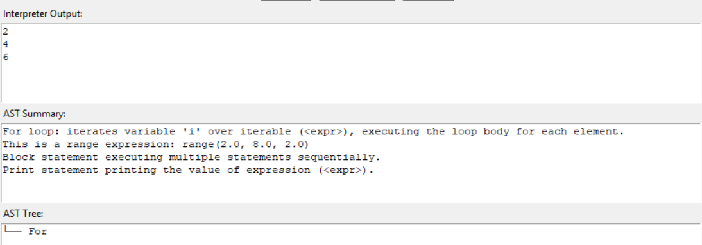

## 13.Len Function
```
nums = [1, 2, 3, 4]
print(len(nums))
```
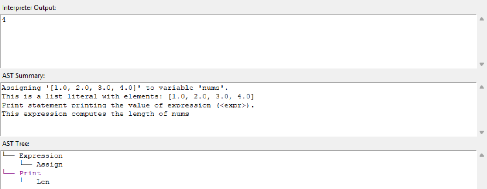
