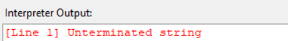

#  Scanner (Lexer)

##  Overview
The **Scanner** (also known as the **Lexer**) is the first stage of the CodeSage pipeline.  
Its main job is to **read raw source code** and convert it into a list of **tokens** — the smallest meaningful symbols like identifiers, keywords, numbers, and operators.

These tokens serve as the **input for the Parser**, which constructs the Abstract Syntax Tree (AST).

---

##  Responsibilities

- Read source code character by character.
- Group characters into **lexical tokens** (e.g., keywords, identifiers, literals, operators).
- Handle **whitespace** and **comments**.
- Detect **invalid or unknown characters** and raise lexical errors.
- Return a structured **token list** to the parser.

---

##  Token Structure

Each token contains:

- `type` → The category of the token (e.g., IDENTIFIER, NUMBER, PLUS, IF)
- `lexeme` → The raw string from the source code
- `literal` → The actual value (if applicable, e.g., number = 42)
- `line` → The line number where it appears

---

##Example

```
a=5
print(a)
```

```
[Scanner Output]:
Token(IDENTIFIER, 'a', None, line=1)
Token(ASSIGN, '=', None, line=1)
Token(NUMBER, '5', 5.0, line=1)
Token(NEWLINE, '\n', None, line=1)
Token(PRINT, 'print', None, line=2)
Token(LPAREN, '(', None, line=2)
Token(IDENTIFIER, 'a', None, line=2)
Token(RPAREN, ')', None, line=2)
Token(EOF, '', None, line=2)
```


##  Error Handling in the Scanner

The Scanner ensures that the source code is lexically valid before parsing begins.  
It primarily detects **character-level and token-level errors** that break the lexical structure of the program.

###  Common Scanner Errors

| Type | Description | Example | Scanner Message |
|------|--------------|----------|------------------|
| **Unexpected Character** | Encountering a symbol that doesn’t belong to the language grammar. | `@`, `#`, `$` in normal code | `[Line 1] Unexpected character: @` |
| **Unterminated String** | A string literal is opened with a quote but never closed. | `"Hello` | `[Line 2] Unterminated string.` |
| **Invalid Number Format** | Malformed numeric literals (e.g., two dots, letters in numbers). | `12.3.4`, `1a2` | `[Line 3] Invalid number format.` |
| **Unknown Escape Sequence** | Use of unsupported escape characters in strings. | `"Hello\q"` | `[Line 5] Invalid escape sequence: \q` |
| **Illegal Identifier Start** | Variable names starting with invalid characters. | `9abc = 5` | `[Line 4] Invalid identifier start: 9` |
| **EOF in Comment** | Multi-line comment not properly closed before end of file. | `/* comment` | `[Line 10] Unterminated comment.` |

---

###  Example: Scanner Error Messages


```
print("Hello)

```


